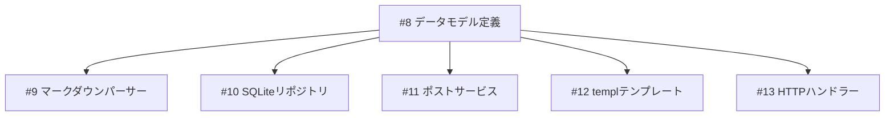

# SPEC-008: データモデル定義

> Issue: #8
> Phase: 1 (ブログエンジン MVP)
> Wave: 1 (基盤)
> サイズ: XS
> 方法論: TDD（新規機能）

---

## 1. 概要

ブログエンジンの基盤となるデータモデル（Post, Tag, Category, Pagination, FeedItem）を定義する。
全ての上位レイヤー（Repository, Service, Handler）がこのモデルに依存するため、
設計の正確さが後続Feat全体に影響する。

---

## 2. スコープ

### IN

- `internal/model/post.go` — Post、PostStatus、Tag、Category構造体
- `internal/model/pagination.go` — ページネーション構造体
- `internal/model/feed.go` — FeedItem構造体（Phase 3用、構造のみ）
- `internal/model/errors.go` — ドメインエラー定義
- 各ファイルの単体テスト

### OUT

- Repository実装（#10）
- Service実装（#11）
- マークダウンパース（#9）

---

## 3. 技術設計

### 3.1 パッケージルール

```
internal/model/
├── post.go           # Post, PostStatus, Tag, Category
├── pagination.go     # ListOptions, PageResult
├── feed.go           # FeedItem
├── errors.go         # ドメインエラー
├── post_test.go      # Postテスト
├── pagination_test.go # ページネーションテスト
└── feed_test.go      # FeedItemテスト
```

**制約**: 標準ライブラリのみ依存（CODING_RULES.md準拠）

### 3.2 Post構造体

```go
type PostStatus string

const (
    PostStatusDraft     PostStatus = "draft"
    PostStatusReview    PostStatus = "review"
    PostStatusPublished PostStatus = "published"
)

type Post struct {
    ID        int64
    Title     string
    Slug      string
    Content   string      // マークダウン原文
    HTML      string      // レンダリング済みHTML
    Excerpt   string      // 抜粋（一覧表示用）
    Date      time.Time   // 記事日付
    Tags      []string
    Category  string
    Status    PostStatus
    SourceURL string      // Obsidian元ファイルパス
    Mermaid   bool        // Mermaidコードブロック含有フラグ
    CreatedAt time.Time
    UpdatedAt time.Time
}
```

**設計判断**:
- `PostStatus`を型付き定数に → 不正値防止
- `Excerpt`追加 → 一覧表示でHTML全文パース回避
- `SourceURL` → Obsidian連携（Phase 2）の基盤

### 3.3 ページネーション

```go
type ListOptions struct {
    Page     int
    PageSize int
    Tag      string
    Category string
    Status   PostStatus
    SortBy   string  // "date", "title", "updated"
    SortDesc bool
}

type PageResult[T any] struct {
    Items      []T
    TotalItems int
    TotalPages int
    Page       int
    PageSize   int
}
```

**設計判断**:
- ジェネリクス使用 → Post以外（FeedItem等）にも再利用可能
- `ListOptions`にフィルタ集約 → Repository引数の簡素化

### 3.4 FeedItem

```go
type FeedItem struct {
    ID          int64
    FeedURL     string
    Title       string
    Link        string
    Description string
    PublishedAt time.Time
    FetchedAt   time.Time
}
```

### 3.5 ドメインエラー

```go
var (
    ErrPostNotFound    = errors.New("ポストが見つかりません")
    ErrInvalidSlug     = errors.New("無効なスラッグです")
    ErrInvalidStatus   = errors.New("無効なステータスです")
    ErrInvalidPage     = errors.New("無効なページ番号です")
    ErrInvalidPageSize = errors.New("無効なページサイズです")
)
```

### 3.6 バリデーションメソッド

```go
func (p *Post) Validate() error          // 必須フィールド検証
func (o *ListOptions) Validate() error    // ページネーション範囲検証
func (s PostStatus) IsValid() bool        // ステータス有効性検証
```

---

## 4. TDD計画

### RED Phase（テスト先行）

| テストファイル | テストケース |
|--------------|-------------|
| post_test.go | PostStatus定数の有効性検証 |
| post_test.go | Post.Validate() — 正常系、タイトル空、スラッグ空 |
| post_test.go | PostStatus.IsValid() — 有効/無効値 |
| pagination_test.go | ListOptions.Validate() — 正常系、Page=0、PageSize超過 |
| pagination_test.go | PageResult計算検証 |
| feed_test.go | FeedItem基本構造テスト |

### GREEN Phase（最小実装）

Issue実装内容に沿った構造体・メソッド定義

### IMPROVE Phase

- godocコメント追加（日本語）
- @MXタグ付与（ANCHOR: fan_in >= 3予定のPost構造体）

---

## 5. 品質ゲート

| ゲート | 基準 |
|--------|------|
| テスト通過 | `go test ./internal/model/...` 全パス |
| カバレッジ | 80%以上 |
| リント | `golangci-lint run` エラー0 |
| フォーマット | `gofmt -l .` 出力なし |
| 依存制約 | 標準ライブラリのみ import |

---

## 6. 依存関係



**影響範囲**: 後続の全Feat（#9-#15）がこのモデルに依存

---

## 7. 受入条件

- [ ] Post, PostStatus, Tag, Category構造体が定義されている
- [ ] ListOptions, PageResult構造体が定義されている
- [ ] FeedItem構造体が定義されている
- [ ] ドメインエラーが定義されている
- [ ] バリデーションメソッドが実装されている
- [ ] テーブルドリブンテスト全パス
- [ ] カバレッジ80%以上
- [ ] 日本語godocコメント100%
- [ ] @MXタグ付与（Post構造体にANCHOR）
