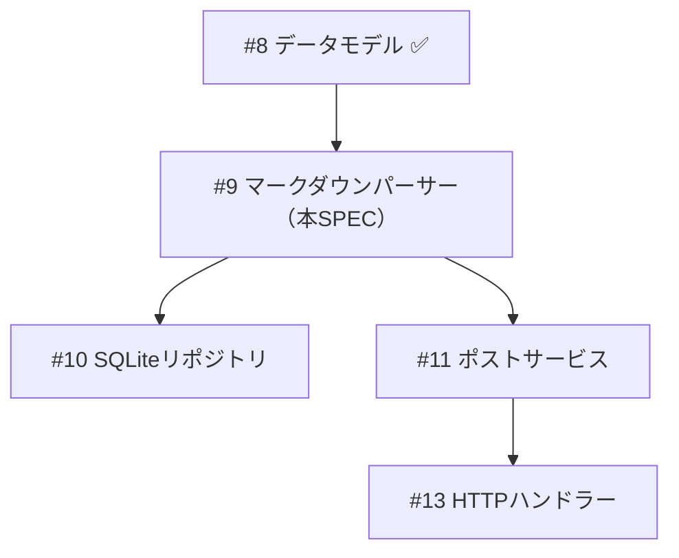

# SPEC-009: マークダウンパーサー実装

> Issue: #9
> Phase: 1 (ブログエンジン MVP)
> Wave: 1 (基盤)
> サイズ: M
> 方法論: TDD（新規機能）
> 依存: SPEC-008（データモデル）

---

## 1. 概要

goldmarkベースのマークダウンパーサーを実装する。
frontmatter（YAML）パース、Mermaidコードブロック保持、
GFM拡張対応を含み、マークダウンファイルをmodel.Post構造体に変換する。

---

## 2. スコープ

### IN

- `internal/markdown/parser.go` — パーサー本体
- `internal/markdown/parser_test.go` — テスト
- `content/posts/hello-world.md` — サンプル記事
- goldmark + goldmark-meta 依存関係追加

### OUT

- HTMLキャッシュ（#11 ポストサービスで対応）
- シンタックスハイライト（Tailwind/CSS側で対応、#14）
- 全文検索インデキシング（#10 SQLiteリポジトリ）

---

## 3. 技術設計

### 3.1 依存関係

```go
import (
    "github.com/yuin/goldmark"
    "github.com/yuin/goldmark/extension"
    "github.com/yuin/goldmark/parser"
    "github.com/yuin/goldmark/renderer/html"
    meta "github.com/yuin/goldmark-meta"
)
```

### 3.2 パッケージ構造

```
internal/markdown/
├── parser.go        # Parser構造体、ParseFile、ParseContent
└── parser_test.go   # テーブルドリブンテスト

content/posts/
└── hello-world.md   # サンプル記事
```

### 3.3 Parser構造体

```go
// Parser はマークダウンをPost構造体に変換するパーサーです。
type Parser struct {
    md goldmark.Markdown
}

// NewParser は新しいParserを生成します。
func NewParser() *Parser

// ParseFile はファイルパスからPost構造体を生成します。
func (p *Parser) ParseFile(path string) (*model.Post, error)

// ParseContent はバイト列からPost構造体を生成します。
func (p *Parser) ParseContent(content []byte) (*model.Post, error)
```

### 3.4 goldmark初期化

```go
func NewParser() *Parser {
    md := goldmark.New(
        goldmark.WithExtensions(
            extension.GFM,          // テーブル、取り消し線、タスクリスト
            meta.Meta,              // frontmatter YAML
        ),
        goldmark.WithParserOptions(
            parser.WithAutoHeadingID(),
        ),
        goldmark.WithRendererOptions(
            html.WithHardWraps(),
            html.WithUnsafe(),      // Mermaid用にrawHTML許可
        ),
    )
    return &Parser{md: md}
}
```

### 3.5 frontmatterマッピング

```yaml
---
title: "記事タイトル"
date: 2026-03-16
tags: [go, htmx]
category: "技術"
status: draft
source_url: ""
mermaid: false
---
```

→ `model.Post` フィールドへマッピング:

| frontmatter | Post フィールド | 型変換 |
|-------------|---------------|--------|
| title | Title | string |
| date | Date | time.Time (YAML自動パース) |
| tags | Tags | []string ([]interface{} → []string) |
| category | Category | string |
| status | Status | PostStatus |
| source_url | SourceURL | string |
| mermaid | Mermaid | bool |

### 3.6 Mermaidコードブロック処理

マークダウン内の ````mermaid` コードブロックを検知:
1. `Post.Mermaid = true` を設定
2. HTMLレンダリング後、`<code class="language-mermaid">` を `<pre class="mermaid">` に置換
   （クライアントサイドのMermaid.jsがレンダリング）

### 3.7 Excerpt生成

Content先頭から最大200文字を抽出（HTMLタグ除去済みテキスト）。

### 3.8 エラー定義

```go
var (
    ErrFileNotFound     = errors.New("ファイルが見つかりません")
    ErrInvalidFrontmatter = errors.New("無効なfrontmatterです")
    ErrEmptyContent     = errors.New("コンテンツが空です")
)
```

---

## 4. TDD計画

### RED Phase

| テストケース | 検証内容 |
|-------------|---------|
| TestParseContent_正常系 | 基本的なマークダウン → Post変換 |
| TestParseContent_frontmatter全フィールド | 全frontmatterフィールドのマッピング |
| TestParseContent_タグ変換 | []interface{} → []string変換 |
| TestParseContent_Mermaid検知 | Mermaidコードブロック → Mermaid=true + HTML保持 |
| TestParseContent_GFM | テーブル、タスクリスト変換 |
| TestParseContent_frontmatterなし | ErrInvalidFrontmatter |
| TestParseContent_空コンテンツ | ErrEmptyContent |
| TestParseContent_Excerpt生成 | 200文字以内の抜粋 |
| TestParseFile_正常系 | ファイル読み込み → Post変換 |
| TestParseFile_存在しないファイル | ErrFileNotFound |

### GREEN Phase

最小実装でテスト通過

### IMPROVE Phase

- godoc日本語コメント追加
- @MXタグ付与（ParseContent: ANCHOR — Service/Handlerから呼び出し）

---

## 5. 品質ゲート

| ゲート | 基準 |
|--------|------|
| テスト通過 | `go test ./internal/markdown/...` 全パス |
| カバレッジ | 80%以上 |
| golangci-lint | エラー0 |
| gofmt | 出力なし |
| make ci | 全チェック通過 |

---

## 6. 依存関係



---

## 7. 受入条件

- [ ] ParseContentでマークダウン → Post構造体に正しく変換される
- [ ] frontmatter全フィールドが正しくマッピングされる
- [ ] Mermaidコードブロックが検知・保持される
- [ ] GFM拡張（テーブル、タスクリスト）が正しくHTML変換される
- [ ] Excerpt（200文字以内）が生成される
- [ ] エラーケース（frontmatterなし、空コンテンツ、ファイル不在）が適切に処理される
- [ ] ParseFileでファイル読み込み → Post変換が動作する
- [ ] サンプル記事（hello-world.md）が正しくパースされる
- [ ] テーブルドリブンテスト全パス、カバレッジ80%以上
- [ ] make ci 全チェック通過
