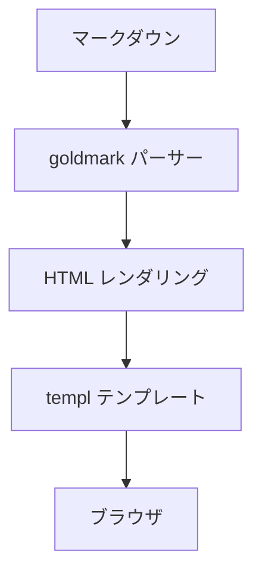

# TechPulse Blogへようこそ

これはTechPulse Blogの最初の記事です。Go + Echo + HTMX + Tailwind CSSで構築された技術ブログです。

## 技術スタック

| 技術 | 用途 |
|------|------|
| Go | バックエンド |
| Echo | Webフレームワーク |
| templ | テンプレート |
| HTMX | フロントエンド |
| Tailwind CSS | スタイリング |
| SQLite | データベース |

## アーキテクチャ



## コード例

```go
func main() {
    fmt.Println("Hello, TechPulse!")
}
```

今後もIT技術トレンドの情報を発信していきます。
